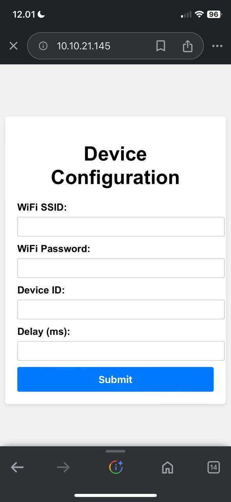
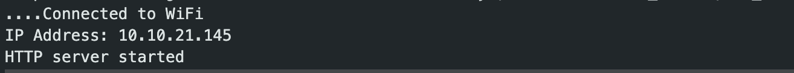
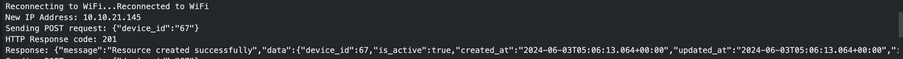

# ESP32 IOT Traffic Light Monitoring

## Overview

This project sets up an ESP32 as a web server to configure its WiFi settings, device ID, and data posting interval. Once configured, the ESP32 connects to the specified WiFi network and periodically sends data to a backend server.

## Usage

1. **Upload the code to the ESP32 using the Arduino IDE.**
2. **Open the Serial Monitor** to observe the connection status and IP address.
3. **Connect to the ESP32's web server** using the IP address shown in the Serial Monitor.
4. **Fill out the form** with the desired WiFi SSID, password, device ID, and delay interval.
5. **Submit the form** to update the configuration. The ESP32 will reconnect to the WiFi with the new credentials and begin posting data at the specified interval.

## Function Explanations

- **setup()**: Initializes the serial communication, connects to the initial WiFi network, prints the IP address, and starts the web server.
- **loop()**: Handles incoming client requests and periodically posts data to the backend server.
- **handleRoot()**: Serves the HTML form for configuration.
- **handleSubmit()**: Processes the form submission, updates WiFi credentials and device settings, and reconnects to WiFi.
- **postData()**: Sends a POST request to the backend server with the device ID in JSON format.

## Backend and Frontend Links

- **Backend Repositories**: [link](https://github.com/agus-darmawan/traffic-light-monitoring-dashboard-be)
- **Frontend Repositories**: [link](https://github.com/agus-darmawan/traffic-light-monitoring-dashboard-fe)

## Screenshots

### Web View Image

  

### IP Serial Monitor

  

### Last Post Status Serial Monitor

  

## Contributing

Contributions are welcome! Please submit a pull request or open an issue to discuss your changes.

## License

This project is licensed under the MIT License.
